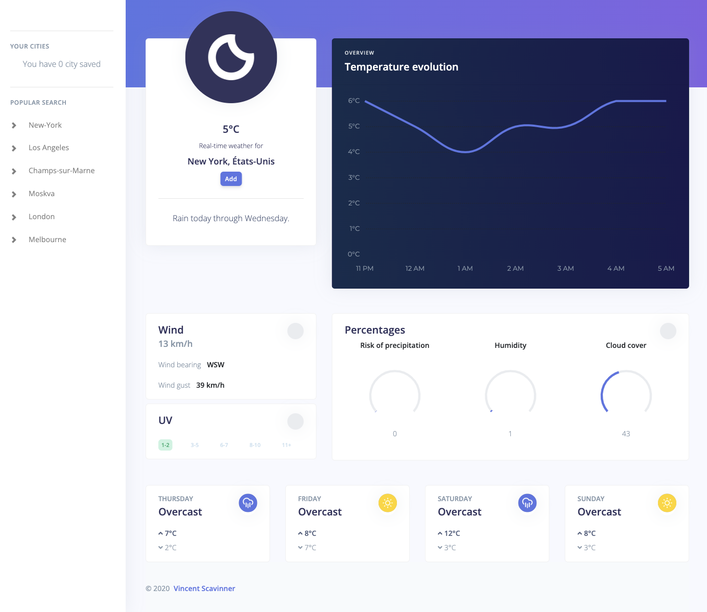

# Weather web application

> Don't get caught out in the rain. Get up to date forecasts with a cool weather app.

<p text-align="center">
  
</p>

## How to install

1. Open your editor and the project folder in the terminal
2. Install all the dependencies by running `yarn install`
3. Develop with `yarn dev`
4. Build the application with `yarn build`

## API keys

The application is powered by APIs so, once the application cloned, you will need to create a new file `src/modules/key.js` and fill it withthe following content:

```javascript
const KEYS = {
  DARKSKY_KEY: "Your DarkSky API key here",
  GOOGLE_KEY: "Your Google API key here",
};

export { KEYS };
```

### Google

For your Google application project, you will need to enable Maps, Places and Geocoding.

### DarkSky

Warning: support for the Dark Sky API will be ending on March 31st, 2023. You can read more about it [here](https://blog.darksky.net/). At this time, the app will not work anymore.
